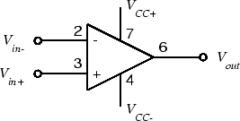
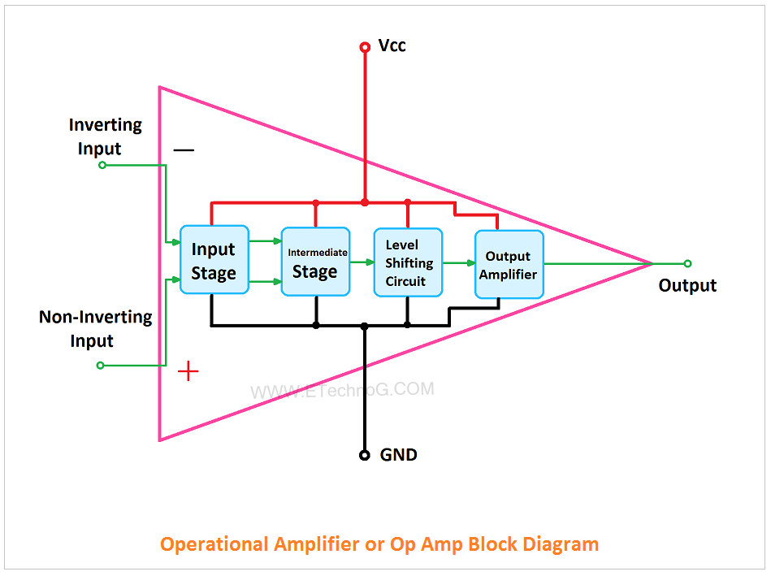
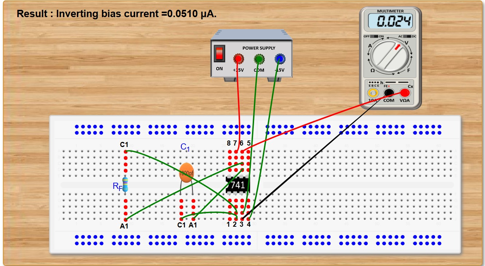
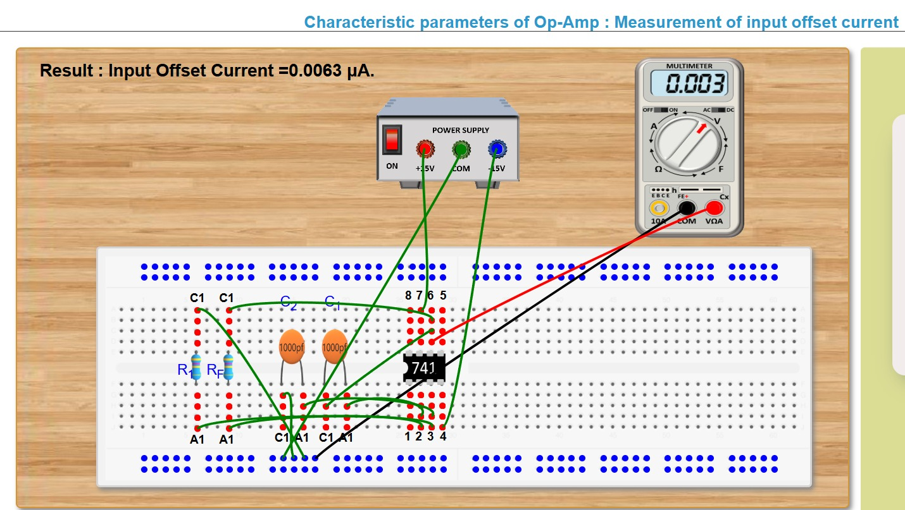
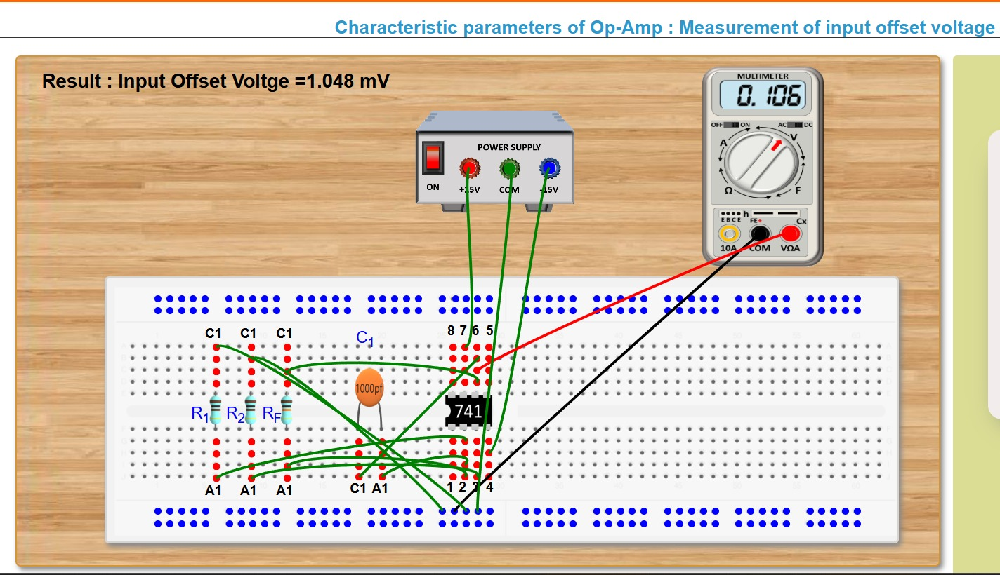
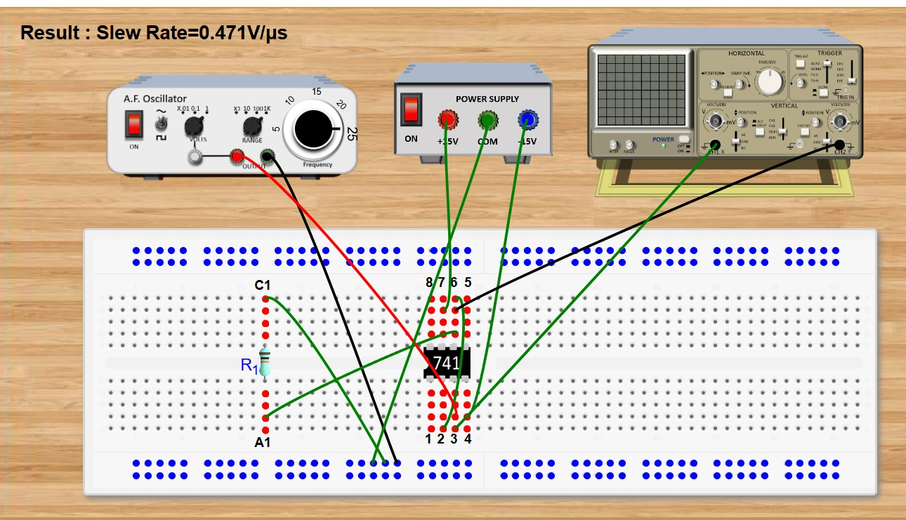
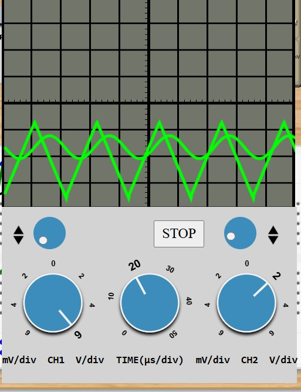

# EXPERIMENT – 03  
## Characteristics and Parameters of IC 741 Operational Amplifier

---

## 🎯 Aim

To study and determine the following parameters of IC 741 operational amplifier:

- Input Bias Current (Inverting Terminal)
- Input Bias Current (Non-Inverting Terminal)
- Input Offset Current
- Input Offset Voltage
- Slew Rate

---

## 🧰 Components Required

- IC 741 Op-Amp
- Breadboard
- DC Power Supply
- Function Generator
- CRO (Cathode Ray Oscilloscope)
- Digital Multimeter
- Resistors
- Capacitors
- Connecting Wires

---

## 📘 Theory – Introduction

- An operational amplifier (Op-Amp) is a direct coupled high gain amplifier.

- It usually consists of one or more differential amplifier stages.

- These stages are followed by a level translator and an output stage.

- The output stage is generally a push-pull or push-pull complementary-symmetry pair.

- An operational amplifier is available as a single integrated circuit (IC) package.

- It is a versatile device that can amplify both DC and AC input signals.

- Originally, the Op-Amp was designed to perform mathematical operations such as:
  - Addition
  - Subtraction
  - Multiplication
  - Integration

- Because of this function, it is called an "operational" amplifier and is abbreviated as Op-Amp.

- With proper external feedback components, modern Op-Amps are used in many applications like:
  - AC and DC signal amplification
  - Active filters
  - Oscillators
  - Comparators
  - Voltage regulators
  - And other electronic circuits

## 🔷 Internal Functional Blocks of Op-Amp

1️⃣ **Input Stage**  
- It is a differential amplifier.  
- Provides high input impedance.  
- Amplifies the difference between inverting and non-inverting inputs.  
- Offers good Common Mode Rejection (CMRR).

2️⃣ **Intermediate Stage**  
- Provides additional voltage gain.  
- Increases overall amplification of the signal.  
- Improves signal strength before final output stage.

3️⃣ **Level Shifting Stage**  
- Adjusts the DC level of the signal.  
- Ensures the output is centered around zero reference.  
- Helps maintain proper biasing conditions.

4️⃣ **Output Stage**  
- Usually a push-pull amplifier.  
- Provides low output impedance.  
- Increases current driving capability.  
- Delivers the final amplified output signal.

---

## ⭐ Characteristics of an Ideal Op-Amp

An ideal operational amplifier has the following properties:

- **Infinite Voltage Gain (A)**  
  The amplifier can amplify the input signal without any limit.

- **Infinite Input Resistance (Ri)**  
  It does not draw any current from the input source.  
  So, there is no loading effect on the previous stage.

- **Zero Output Resistance (Ro)**  
  The output can supply current to any number of devices without voltage drop.

- **Zero Output Voltage when Input is Zero**  
  If the input voltage is zero, the output voltage will also be exactly zero.

- **Infinite Bandwidth**  
  It can amplify signals of any frequency from 0 Hz to infinity without reduction in gain.

- **Infinite Common Mode Rejection Ratio (CMRR)**  
  It completely rejects common-mode signals (noise present at both inputs).  
  Only the difference between the inputs is amplified.

- **Infinite Slew Rate**  
  The output voltage changes instantly according to changes in input voltage.

# 1️⃣ Input Bias Current (Inverting Terminal)

### Formula Used

IB = Vo / Rf

### Procedure

1. Connect the IC 741 as per circuit diagram.
2. Apply required DC supply.
3. Measure output voltage.
4. Calculate input bias current.

### 🔽 Circuit Screenshot

---

# 2️⃣ Input Offset Current

### Definition

Input offset current is the difference between bias currents at two input terminals.

Iio = | IB1 − IB2 |

### Formula

Iio = Vo / Rf

### 🔽 Circuit Screenshot

---

# 3️⃣ Input Offset Voltage

### Definition

Input offset voltage is the small DC voltage required between input terminals to make output zero.

For IC 741:
Maximum Vio ≈ 6mV

### Procedure

1. Configure the circuit.
2. Adjust potentiometer to null output.
3. Measure voltage across input terminals.

### 🔽 Circuit Screenshot

---

# 4️⃣ Slew Rate

### Definition

Slew Rate (SR) is the maximum rate of change of output voltage.

SR = (dVo/dt) max

Unit: V/µs

For IC 741:
Typical SR ≈ 0.5 V/µs

### Procedure

1. Apply square wave input.
2. Observe output on CRO.
3. Measure rise time.
4. Calculate slew rate.

SR = ΔV / Δt

### 🔽 Circuit Screenshot

---

## 📊 Result

The parameters of IC 741 such as input bias current, input offset current, input offset voltage and slew rate were measured successfully. The obtained values are approximately close to the standard datasheet values.

---

## ✅ Conclusion

The characteristics and performance parameters of IC 741 operational amplifier were studied and verified using virtual lab simulation. The experimental results validate the theoretical concepts of operational amplifier operation.

---

## 📎 References

- IC 741 Datasheet
- Virtual Lab Simulation
