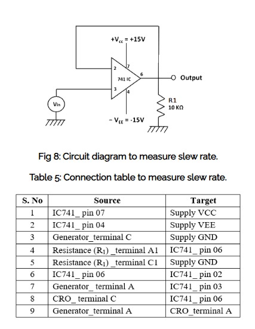

## EXPERIMENT – 03  
## Characteristics and Parameters of IC 741 Operational Amplifier

---

## 🎯 Aim

To study and determine the following parameters of IC 741 operational amplifier:

- Input Bias Current (Inverting Terminal)
- Input Bias Current (Non-Inverting Terminal)
- Input Offset Current
- Input Offset Voltage
- Slew Rate

---

## 🧰 Components Required

- IC 741 Op-Amp
- Breadboard
- DC Power Supply
- Function Generator
- CRO (Cathode Ray Oscilloscope)
- Digital Multimeter
- Resistors
- Capacitors
- Connecting Wires

---

## 📘 Theory – Introduction

- An operational amplifier (Op-Amp) is a direct coupled high gain amplifier.

- It usually consists of one or more differential amplifier stages.

- These stages are followed by a level translator and an output stage.

- The output stage is generally a push-pull or push-pull complementary-symmetry pair.

- An operational amplifier is available as a single integrated circuit (IC) package.

- It is a versatile device that can amplify both DC and AC input signals.

- Originally, the Op-Amp was designed to perform mathematical operations such as:
  - Addition
  - Subtraction
  - Multiplication
  - Integration

- Because of this function, it is called an "operational" amplifier and is abbreviated as Op-Amp.

- With proper external feedback components, modern Op-Amps are used in many applications like:
  - AC and DC signal amplification
  - Active filters
  - Oscillators
  - Comparators
  - Voltage regulators
  - And other electronic circuits

## 🔷 Internal Functional Blocks of Op-Amp

1️⃣ **Input Stage**  
- It is a differential amplifier.  
- Provides high input impedance.  
- Amplifies the difference between inverting and non-inverting inputs.  
- Offers good Common Mode Rejection (CMRR).

2️⃣ **Intermediate Stage**  
- Provides additional voltage gain.  
- Increases overall amplification of the signal.  
- Improves signal strength before final output stage.

3️⃣ **Level Shifting Stage**  
- Adjusts the DC level of the signal.  
- Ensures the output is centered around zero reference.  
- Helps maintain proper biasing conditions.

4️⃣ **Output Stage**  
- Usually a push-pull amplifier.  
- Provides low output impedance.  
- Increases current driving capability.  
- Delivers the final amplified output signal.

---

## ⭐ Characteristics of an Ideal Op-Amp

An ideal operational amplifier has the following properties:

- **Infinite Voltage Gain (A)**  
  The amplifier can amplify the input signal without any limit.

- **Infinite Input Resistance (Ri)**  
  It does not draw any current from the input source.  
  So, there is no loading effect on the previous stage.

- **Zero Output Resistance (Ro)**  
  The output can supply current to any number of devices without voltage drop.

- **Zero Output Voltage when Input is Zero**  
  If the input voltage is zero, the output voltage will also be exactly zero.

- **Infinite Bandwidth**  
  It can amplify signals of any frequency from 0 Hz to infinity without reduction in gain.

- **Infinite Common Mode Rejection Ratio (CMRR)**  
  It completely rejects common-mode signals (noise present at both inputs).  
  Only the difference between the inputs is amplified.

- **Infinite Slew Rate**  
  The output voltage changes instantly according to changes in input voltage.
  
## 🔷 Op-Amp IC 741 – Pin Configuration

The pin configuration of IC 741 general purpose operational amplifier is shown in the pin diagram.

- The reference point of the IC is the **notch at the top**.
- The pins are numbered in a **counter-clockwise direction**, starting from the notch.

### 📌 Pin Description

- **Pin 1 and Pin 5 – Offset Null Pins**
  - Used for offset voltage adjustment.
  - The op-amp is very sensitive, so sometimes output may appear even without input.
  - To eliminate this unwanted output, offset null pins are provided.
  - These pins are usually connected to a potentiometer.
  - The potentiometer is adjusted to make the output voltage at **Pin 6 equal to zero**.

- **Pin 2 – Inverting Input**
  - Input signal applied here produces an output of opposite polarity at Pin 6.

- **Pin 3 – Non-Inverting Input**
  - Input signal applied here produces an output of same polarity at Pin 6.

- **Pin 4 – Negative Supply (VCC)**
  - Connected to ground or negative voltage (typically -3V to -18V).

- **Pin 7 – Positive Supply (VCC)**
  - Connected to the positive voltage supply.

- **Pin 6 – Output Pin**
  - The amplified output signal is obtained from this pin.

- **Pin 8 – No Connection (NC)**
  - This pin is not internally connected.
--- 
  
# A. Measurement of Input Bias Current (IB)

## a) Measurement of Inverting Bias Current (IB₁)

### Step 1:
Click on the **Components** button and place all required components on the table.
### Step 2:
Make the connections exactly as shown in the circuit diagram or connection table.
### Step 3:
Click on **"Check Connection"** to verify the circuit.  
If the connections are correct, click on **"Show Output Voltage"** to see the output on DMM.
### Step 4:
Calculate the inverting bias current using the formula:
IB₁ = Vo / Rf
### Step 5:
Click on **"Result"** and enter the calculated value.
### Step 6:
Click on **"Reset"** and proceed to measure the inverting bias current.

### 🔽 Circuit Screenshot

---

## b) Measurement of Non-Inverting Bias Current (IB₂)

### Step 1:
Click on the **Components** button and place the required components.
### Step 2:
Make the connections as per the circuit diagram or connection table.
### Step 3:
Click on **"Check Connection"**.  
If correct, click on **"Show Output Voltage"** to view output on DMM.
### Step 4:
Calculate the non-inverting bias current using:
IB₂ = Vo / R1
### Step 5:
Click on **"Result"** and enter the calculated value.

### 🔽 Circuit Screenshot

---
# B. Measurement of Input Offset Current (Iio)

### Step 1:
Click on the **Components** button and place the components on the table.
### Step 2:
Make connections as per the circuit diagram or connection table.
### Step 3:
Click on **"Check Connection"**.  
If correct, click on **"Show Output Voltage"** to view Vo on DMM.
### Step 4:
Calculate the input offset current using:
Iio = Vo / Rf
### Step 5:
Click on **"Result"** and enter the calculated value.
### 🔽 Circuit Screenshot

---

# C. Measurement of Input Offset Voltage (Vio)

### Step 1:
Click on the **Components** button and place all required components on the table.
### Step 2:
Make the connections exactly as shown in the circuit diagram or connection table.
### Step 3:
Click on **"Check Connection"** to verify the circuit.  
If correct, click on **"Show Output Voltage"** to view output (Vo) on DMM.
### Step 4:
Calculate the input offset voltage using the formula:
Vio = (Vo − IioRf) / (1 + Rf/Ri)
### Step 5:
Click on **"Result"** and enter the calculated value.
### 🔽 Circuit Screenshot

---

# D. Measurement of Slew Rate (S.R.)

### Step 1:
Click on the **Components** button and place the required components on the table.
### Step 2:
Make the connections as per the circuit diagram or connection table.
### Step 3:
Take the input signal from the red terminal of the A.F. Oscillator.  
Connect the other terminal to ground.
### Step 4:
Feed the input signal to **Channel CH1 of the CRO**.  
Feed the output of the Op-Amp (Pin 6) to **Channel CH2 of the CRO**.
### Step 5:
Click on **"Check Connection"**.  
If correct, click on **"Show Output Voltage"**.
### Step 6:
Increase the frequency of the input signal using the dial on the A.F. Oscillator until the output waveform becomes triangular.  
This frequency is the required **fmax (in KHz)**.
### Step 7:
Calculate the slew rate using the formula:
S.R. = 2πfmaxVm / 10⁶  V/µs
Where:
Vm = 3V (Amplitude of input signal)
### Step 8:
Click on **"Result"** and enter the calculated value.
### 🔽 Circuit Screenshot

---

# 📊 Result

The important parameters of the IC 741 operational amplifier were successfully measured using the virtual lab setup.

The following characteristics were determined:

- Inverting Bias Current (IB₁)
- Non-Inverting Bias Current (IB₂)
- Average Input Bias Current (IB)
- Input Offset Current (Iio)
- Input Offset Voltage (Vio)
- Slew Rate (SR)

From the experiment, it was observed that:

- The input bias currents were in the nanoampere range, which indicates that the IC 741 draws very small input current.
- The input offset current was also very small, showing that the two input terminals are closely matched but not perfectly identical.
- The input offset voltage was found to be in millivolt range, which explains why a small output appears even when no input is applied.
- The slew rate measurement showed that the output does not change instantaneously with the input at higher frequencies.
- The practical slew rate value was found to be approximately close to the standard value of 0.5 V/µs for IC 741.

The experimental values were reasonably close to the theoretical and datasheet values, confirming proper functioning of the op-amp.

---

# ✅ Conclusion

In this experiment, the characteristics and performance parameters of the IC 741 operational amplifier were studied in detail.

I practically observed that:

- An op-amp does not behave ideally in real conditions.
- Small bias currents flow into the input terminals.
- A small offset voltage exists even when no input is applied.
- The output cannot change infinitely fast due to limited slew rate.

These practical limitations explain why real operational amplifiers differ from ideal op-amp assumptions.

The experiment also helped in understanding:

- The internal behavior of differential inputs.
- The importance of offset correction.
- The effect of slew rate in high frequency applications.
- How theoretical formulas relate to practical measurements.

Overall, the experiment provided a clear understanding of the real-world behavior of IC 741 and validated the theoretical concepts of operational amplifiers.

Hence, the characteristics and parameters of IC 741 were successfully studied and verified.

## 📚 References

- R. A. Gayakwad, *Operational Amplifiers and Linear ICs*, 4th Edition, Pearson Education.
- Sergio Franco, *Design with Operational Amplifiers and Analog Integrated Circuits*, Tata McGraw Hill.
- D. Roy Choudhury & Shail Jain, *Linear Integrated Circuits*, New Age International.
- V.K. Mehta & Rohit Mehta, *Principles of Electronics*, S. Chand.
- David A. Bell, *Operational Amplifiers and Linear ICs*, Oxford University Press.
- Virtual Labs – Analog and Digital Electronics II, IIT.
